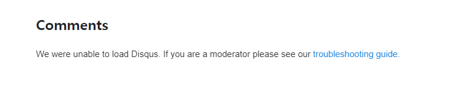

# 소프트웨어학부 20213039 이상진 <!-- omit in toc -->

- git허브 이름을 <username>.github.io 를 하면 자동으로 블로그용 깃허브로 인식
- git clone <주소>를 통해 repositories를 클론

- index.html 실험 해봄

- 기존 index.html 삭제후 jekyll new . --force 명령어를 통해 블로그 형식 틀 만들기

## git push하는 방법 <!-- omit in toc -->

- 먼저 git add <이름 or 주소> 를 넣어 해당 내용 추가

- git commit 으로 커밋내용 남기기

- git push origin main 를 이용해 main 브랜치에 넣기

## 테마 적용하기 <!-- omit in toc -->

- 테마 사이트 http://jekyllthemes.org/에 접속해서 테마 찾기

- Monophase라는 테마를 찾음 (http://jekyllthemes.org/themes/monophase/)

- 깃허브 주소를 클론해 테마를 다운후 적당히 덮어쓰기해서 적용 시킴

## 댓글 적용하기 <!-- omit in toc -->

- DISQUS 사이트 아이디를 만든 후 영상대로 진행

- 적용은 했지만 오류가 떠서 댓글 기능을 못씀

- 영상 찾아보고, 사이트 Q&A를 봐도 해결방법을 모르겠음

## 포스터 작성하기 <!-- omit in toc -->

- 테스트 포스터 2개를 작성했으니 이걸 위주로 수업에 배운 내용에 관해 작성

- 포스터를 하나 만든후

`
---
layout: post
title:  "포스터 이름"
date:   "시간" +0900
categories: jekyll update
comments: true
---
`

- layout은 포스터 형태 title은 포스터 이름 data는 시간 categories는 jekyll comments는 댓글 기능을 활성화 하기위한 true

- comments가 없거나 false면 댓글 그 포스터는 댓글 기능 X

# 지금까지 블로그 만들기였습니다. 감사합니다!
